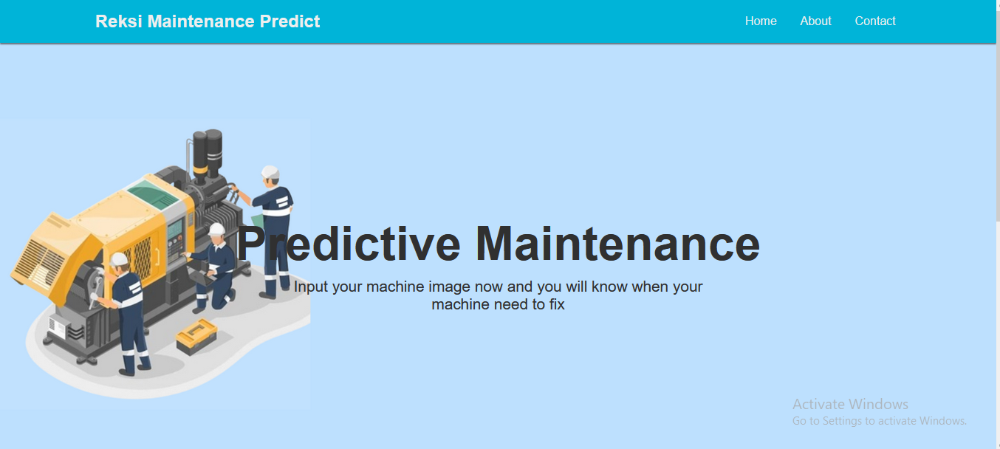
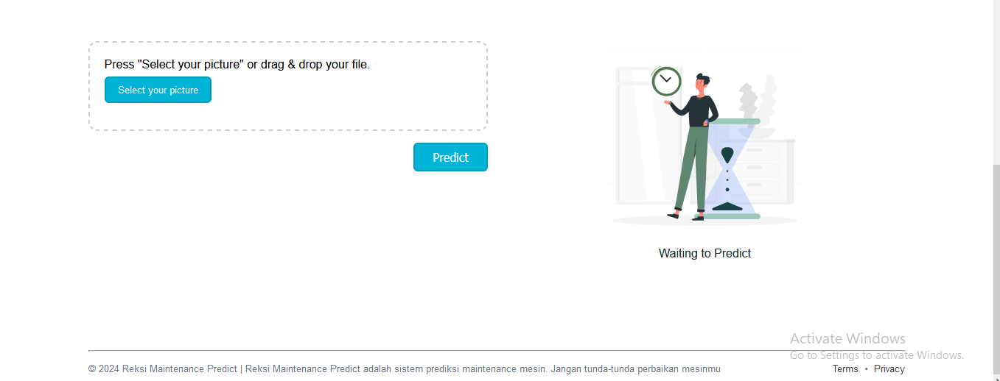

# UAS-AI_G1A022032
## Final Project Artificial Intelligence

Predictive Maintenance System dengan bantuan AI adalah pendekatan dalam pemeliharaan yang menggunakan data dan analisis untuk memprediksi kapan suatu peralatan akan mengalami kerusakan atau kegagalan, sehingga tindakan perbaikan dapat diambil sebelum kegagalan tersebut terjadi. Pendekatan ini berbeda dengan pemeliharaan preventif, yang melibatkan jadwal pemeliharaan teratur berdasarkan perkiraan umur pakai peralatan atau pengalaman.
Berikut Penerapan Predictive Maintenance System: 

## Home

Tampilan website dari sebuah sistem perawatan prediktif berbasis kecerdasan buatan yang disebut "Reksi Predictive Maintenance". Sistem ini menawarkan solusi "Free Predictive Maintenance System". Saya dominan menggunakan warna biru laut dalam pembuatan website ini. Pada bagian home ini saya membuat background dengan gambar animasi orang sedang melakukan perbaikan mesin dan juga tulisan "Predictive Maintenance"

## Form Untuk Prediksi Kerusakan

Pada bagian ini saya membuat tempat untuk upload foto. Terdapat sebuah formulir yang meminta pengguna untuk mengunggah gambar yang akan diprediksi oleh sistem. Untuk memasukkan gambar bisa dengan cara mengklik "Select Your Picture" atau bisa juga dengan drag & drop. Kemudian terdapat tombol "Predict" yang akan memulai proses prediksi kerusakan berdasarkan gambar yang diunggah oleh pengguna.
